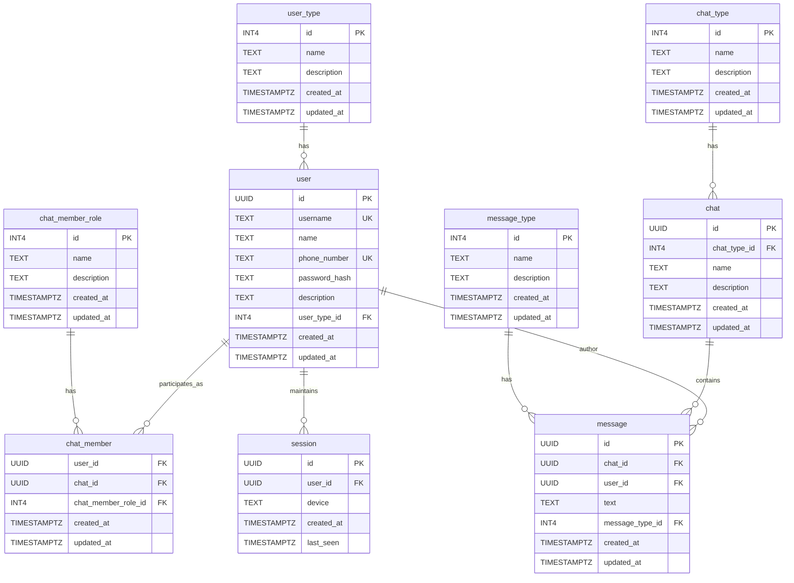

# Описание отношений базы данных

## Таблица user
---
Хранит информацию о пользователях сервиса\
`{id} -> username, name, phone_number, password_hash, description, user_type_id, created_at, updated_at`\
`{username} -> id, name, phone_number, password_hash, description, user_type_id, created_at, updated_at`\
`{phone_number} -> id, username, name, password_hash, description, user_type_id, created_at, updated_at`
- **1НФ** - все атрибуты атомарны, нет составных типов данных
- **2НФ** - все неключевые атрибуты полностью зависят от первичного ключа {id}
- **3НФ** - отсутствуют транзитивные зависимости, все неключевые атрибуты зависят только от ключа
- **НФБК** - все детерминанты (id, username, phone_number) являются потенциальными ключами

## Таблица user_type
---
Хранит типы пользователей (обычный пользователь, пользователь с подпиской)\
`{id} -> name, description, created_at, updated_at`
- **1НФ** - все атрибуты атомарны
- **2НФ** - неключевые атрибуты полностью зависят от первичного ключа
- **3НФ** - нет транзитивных зависимостей
- **НФБК** - отношение находится в 3НФ и имеет один потенциальный ключ

## Таблица chat
---
Хранит информацию о чатах\
`{id} -> chat_type_id, name, description, created_at, updated_at`
- **1НФ** - все атрибуты атомарны
- **2НФ** - все неключевые атрибуты полностью зависят от первичного ключа
- **3НФ** - нет транзитивных зависимостей
- **НФБК** - отношение находится в 3НФ и имеет один потенциальный ключ

## Таблица chat_type
---
Хранит типы чатов (личные сообщения, группа, канал)\
`{id} -> name, description, created_at, updated_at`
- **1НФ** - все атрибуты атомарны
- **2НФ** - неключевые атрибуты полностью зависят от первичного ключа
- **3НФ** - нет транзитивных зависимостей
- **НФБК** - отношение находится в 3НФ и имеет один потенциальный ключ

## Таблица chat_member
---
Хранит информацию об участниках чатов и их ролях\
`{user_id, chat_id} -> chat_member_role_id, created_at, updated_at`
- **1НФ** - все атрибуты атомарны
- **2НФ** - составной первичный ключ, неключевые атрибуты зависят от всего ключа
- **3НФ** - нет транзитивных зависимостей
- **НФБК** - отношение находится в 3НФ и имеет один потенциальный ключ

## Таблица chat_member_role
---
Хранит роли участников чатов (администратор, писатель, наблюдатель)\
`{id} -> name, description, created_at, updated_at`
- **1НФ** - все атрибуты атомарны
- **2НФ** - неключевые атрибуты полностью зависят от первичного ключа
- **3НФ** - нет транзитивных зависимостей
- **НФБК** - отношение находится в 3НФ и имеет один потенциальный ключ

## Таблица message
---
Хранит сообщения в чатах\
`{id} -> chat_id, user_id, text, message_type_id, created_at, updated_at`
- **1НФ** - все атрибуты атомарны
- **2НФ** - все неключевые атрибуты полностью зависят от первичного ключа
- **3НФ** - нет транзитивных зависимостей
- **НФБК** - отношение находится в 3НФ и имеет один потенциальный ключ

## Таблица message_type
---
Хранит типы сообщений (системное или пользовательское)\
`{id} -> name, description, created_at, updated_at`
- **1НФ** - все атрибуты атомарны
- **2НФ** - неключевые атрибуты полностью зависят от первичного ключа
- **3НФ** - нет транзитивных зависимостей
- **НФБК** - отношение находится в 3НФ и имеет один потенциальный ключ

## Таблица session
---
Хранит информацию о сессиях пользователей\
`{id} -> user_id, device, created_at, last_seen`
- **1НФ** - все атрибуты атомарны
- **2НФ** - все неключевые атрибуты полностью зависят от первичного ключа
- **3НФ** - нет транзитивных зависимостей
- **НФБК** - отношение находится в 3НФ и имеет один потенциальный ключ

# ER Diagram

