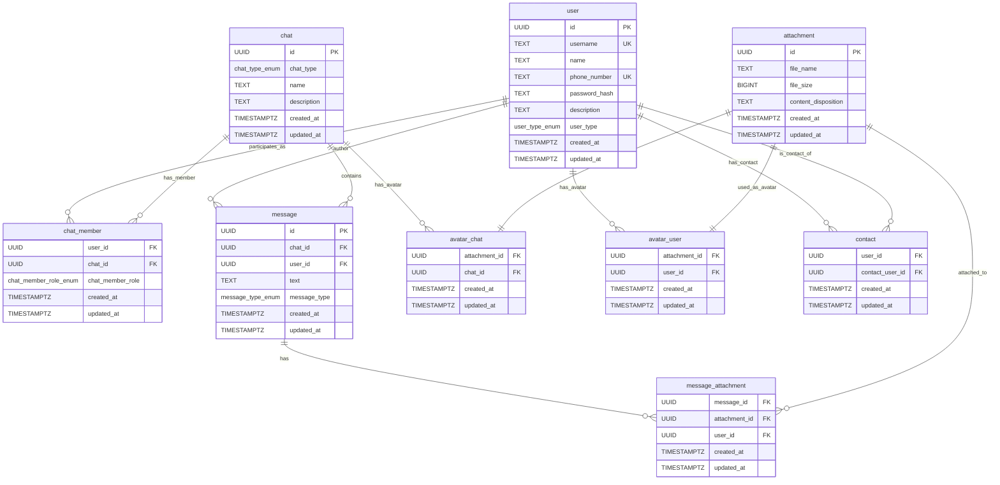

# Описание отношений базы данных

## Таблица user
---
Хранит информацию о пользователях сервиса\
`{id} -> username, name, phone_number, password_hash, description, user_type, created_at, updated_at`\
`{username} -> id, name, phone_number, password_hash, description, user_type, created_at, updated_at`\
`{phone_number} -> id, username, name, password_hash, description, user_type, created_at, updated_at`

**Ограничения целостности:**
- `id` - UUID, первичный ключ, автогенерация через `gen_random_uuid()`
- `username` - уникальный, длина 3-20 символов
- `name` - обязательный, длина 1-20 символов
- `phone_number` - уникальный, формат проверяется регулярным выражением
- `password_hash` - bcrypt hash, фиксированная длина 60 символов
- `description` - опциональный, максимум 500 символов
- `user_type` - enum ('user', 'premium', 'verified'), по умолчанию 'user'

**Нормальные формы:**
- **1НФ** - все атрибуты атомарны, нет составных типов данных
- **2НФ** - все неключевые атрибуты полностью зависят от первичного ключа {id}
- **3НФ** - отсутствуют транзитивные зависимости, все неключевые атрибуты зависят только от ключа
- **НФБК** - все детерминанты (id, username, phone_number) являются потенциальными ключами

## Таблица chat
---
Хранит информацию о чатах\
`{id} -> chat_type, name, description, created_at, updated_at`

**Ограничения целостности:**
- `id` - UUID, первичный ключ
- `chat_type` - enum ('channel', 'dialog', 'group')
- `name` - обязательный, длина 1-100 символов
- `description` - опциональный, максимум 1000 символов

**Нормальные формы:**
- **1НФ** - все атрибуты атомарны
- **2НФ** - все неключевые атрибуты полностью зависят от первичного ключа
- **3НФ** - нет транзитивных зависимостей
- **НФБК** - отношение находится в 3НФ и имеет один потенциальный ключ

## Таблица chat_member
---
Хранит информацию об участниках чатов и их ролях\
`{user_id, chat_id} -> chat_member_role, created_at, updated_at`

**Ограничения целостности:**
- Составной первичный ключ (user_id, chat_id)
- `user_id` - внешний ключ на user(id) с каскадным удалением
- `chat_id` - внешний ключ на chat(id) с каскадным удалением
- `chat_member_role` - enum ('admin', 'writer', 'viewer')

**Нормальные формы:**
- **1НФ** - все атрибуты атомарны
- **2НФ** - составной первичный ключ, неключевые атрибуты зависят от всего ключа
- **3НФ** - нет транзитивных зависимостей
- **НФБК** - отношение находится в 3НФ и имеет один потенциальный ключ

## Таблица message
---
Хранит сообщения в чатах\
`{id} -> chat_id, user_id, text, message_type, created_at, updated_at`

**Ограничения целостности:**
- `id` - UUID, первичный ключ
- `chat_id` - внешний ключ на chat(id) с каскадным удалением
- `user_id` - внешний ключ на user(id) с каскадным удалением
- `text` - обязательный, длина 1-4000 символов
- `message_type` - enum ('user', 'system'), по умолчанию 'user'

**Нормальные формы:**
- **1НФ** - все атрибуты атомарны
- **2НФ** - все неключевые атрибуты полностью зависят от первичного ключа
- **3НФ** - нет транзитивных зависимостей
- **НФБК** - отношение находится в 3НФ и имеет один потенциальный ключ

## Таблица attachment
---
Хранит информацию о файловых вложениях\
`{id} -> file_name, file_size, content_disposition, created_at, updated_at`

**Ограничения целостности:**
- `id` - UUID, первичный ключ
- `file_name` - обязательный, длина 1-255 символов
- `file_size` - положительное число (BIGINT)
- `content_disposition` - длина 1-100 символов

**Нормальные формы:**
- **1НФ** - все атрибуты атомарны
- **2НФ** - все неключевые атрибуты полностью зависят от первичного ключа
- **3НФ** - нет транзитивных зависимостей
- **НФБК** - отношение находится в 3НФ и имеет один потенциальный ключ

## Таблица avatar_chat
---
Хранит связь между чатами и их аватарами\
`{attachment_id, chat_id} -> created_at, updated_at`

**Ограничения целостности:**
- Составной первичный ключ (attachment_id, chat_id)
- `attachment_id` - внешний ключ на attachment(id) с каскадным удалением
- `chat_id` - внешний ключ на chat(id) с каскадным удалением

## Таблица avatar_user
---
Хранит связь между пользователями и их аватарами\
`{attachment_id, user_id} -> created_at, updated_at`

**Ограничения целостности:**
- Составной первичный ключ (attachment_id, user_id)
- `attachment_id` - внешний ключ на attachment(id) с каскадным удалением
- `user_id` - внешний ключ на user(id) с каскадным удалением

## Таблица message_attachment
---
Хранит связь между сообщениями и их вложениями\
`{message_id, attachment_id} -> user_id, created_at, updated_at`

**Ограничения целостности:**
- Составной первичный ключ (message_id, attachment_id)
- `message_id` - внешний ключ на message(id) с каскадным удалением
- `attachment_id` - внешний ключ на attachment(id) с каскадным удалением
- `user_id` - внешний ключ на user(id) с каскадным удалением

## Таблица contact
---
Хранит контакты пользователей\
`{user_id, contact_user_id} -> created_at, updated_at`

**Ограничения целостности:**
- Составной первичный ключ (user_id, contact_user_id)
- `user_id` - внешний ключ на user(id) с каскадным удалением
- `contact_user_id` - внешний ключ на user(id) с каскадным удалением
- Ограничение: `user_id != contact_user_id` (нельзя добавить себя в контакты)

## Триггеры и функции

### update_updated_at_column()
Функция автоматически обновляет поле `updated_at` при изменении записи:
```sql
CREATE OR REPLACE FUNCTION update_updated_at_column()
RETURNS TRIGGER AS $$
BEGIN
    NEW.updated_at = NOW();
    RETURN NEW;
END;
$$ language 'plpgsql';
```

Триггеры установлены на все основные таблицы для автоматического обновления timestamps.

# ER Diagram


````
